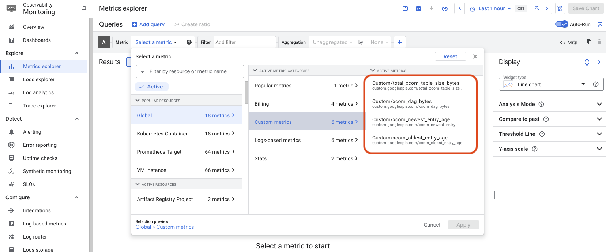

# XCOM Monitoring Tool

This repository contains the code of an utility DAG, which queries the size of XCOM entries within the Airflow metadata DB in Google Cloud Composer and publish that info into convenient Custom Metrics. 

## What is xcom?
XCOM (cross-communications) is a way of putting tasks into communication, so that data can be passed conveniently from one task to another. 
By default, Cloud Composer uses the AirFlow database to implement xcom. When a task uses xcom to pass data to another one, such data is stored within the "xcom" table in the AirFlow database. Thus, the downstream tasks can access the data using the same table. Of course, the data serialization and de-serialization happens transparently thanks to AirFlow libraries that take care of it.

## Why do we need to care about it?
XCOM is very conveniente and powerful, but comes at a price. In order to store potentially large data, the xcom table is persisted using [TOAST](https://www.postgresql.org/docs/current/storage-toast.html). Shortly put, TOAST is technique that allows storing large data into columns, spanning over the fixed page size of the DB (PostgresSQL). _Toasted_ data can be suject to compression and adds great overhead to specific operations, such as export, backup and so even large retrival. 

Google Cloud Composer might trigger the export operation on the XCOM table in certain circumstances, such as creating a snapshot of the environment or before an environment upgrade. Since such operations are subjected to timeouts, the overhead introduced by large XCOM usage is relevant, and might produce timeouts, causing the operation to fail. [As per official documentation](https://cloud.google.com/composer/docs/composer-2/cleanup-airflow-database?hl=en), the airflow database size should not exceed 16 GB: growing over this threshould would prevent upgrades to the environment. Exceeding over 20 GB will also prevent the creation of snapshots.

The Airflow DB contains more than just the XCOM table, therefore the 16 GB limit applies to a broader number of objects. 
The 16 GB limit applies to the entire Airflow DB, not only to the XCOM table. **This means the limit for the XCOM table is lower than 16 GB**. In my experience, **I've noticed that upgrades might fail in case the xcom table goes over 10 GB**, even if the entire Airflow DB stays below 16 GB limit. Unfortunately, there is no mention of the size limit of the sole XCOM table: the documentation only states not to [abuse xcom mechanism](https://cloud.google.com/composer/docs/composer-2/cleanup-airflow-database?hl=en#db-performance) and to evaluate alternative ways of passing huge amount of data (i.e. Google Cloud Storage). This means we need to keep an eye on the XCOM table size specifically rather than the entire Airflow DB size. 

## How does this dag help?
The DAG code contained in this repository helps taking under control specifically the xcom table size. It gives visibility on the size occupied for each TASK and DAG. 

The DAG creates the following global metrics.

| Metric                       | Description                             |
|------------------------------|-----------------------------------------|
|  total_xcom_table_size_bytes | Size in bytes of the entire xcom table  |
|  xcom_dag_bytes              | Size in bytes of the task/dag values. Calcualted at task/dag level, can be aggregated to DAG level. |
|  xcom_oldest_entry_age       | Age in seconds of the oldest entry in the xcom table for each task/dag entry |
|  xcom_newest_entry_age       |  Age in seconds of the most recent entry in the xcom table for each task/dag entry |

By leveraging these metrics, it's possible to setup specific alert policies within Google Cloud Monitoring. 
An example of an alert policy that triggers when the XCOM table grows over 4 GB is provided in the `cloud_monitoring` folder, in the form of a terraform script.

## Prerequisites & Setup
### Python Libraries
Make sure the following pypi packages are installed within the composer environment where running the `xcom_monitor.py` dag:
- google-cloud-monitoring

### GCP Permissions
The DAG script will create custom metrics and populate them by writing time-series. Moreover, the DAG is also writing to the logs debugging information. This means the service account running the DAG should be granted the necessary permissions for handling logging and metrics. A convenient way to do so is to grant the role `roles/composer.worker` which already bundles all the needed permissions.

### Setup
Installing the DAG is as simple as dropping the file named `xcom_monitor.py` within the DAG folder of the composer environment we want to gather metrics from. 

The DAG is configured to run every 5 minutes and to populate all the metrics accordingly. It's fairly easy to change that schedule: just change the `_SCHEDULE_INTERVAL` variable value in the DAG's script to whatever fits your needs, and upload again the DAG within the DAGs folder. 

### Testing
As soon as the xcom_monitor DAG is enabled, you can manually run it or wait for the first execution to be triggered as per schedule. If everything works as expected, you'll see new metrics within the Google Cloud Monitoring console, under the "global" section, as per image below.

